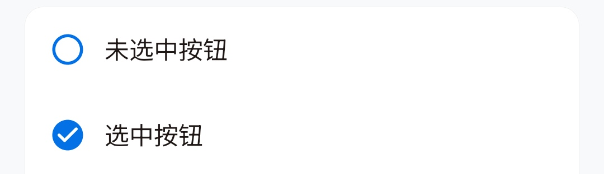
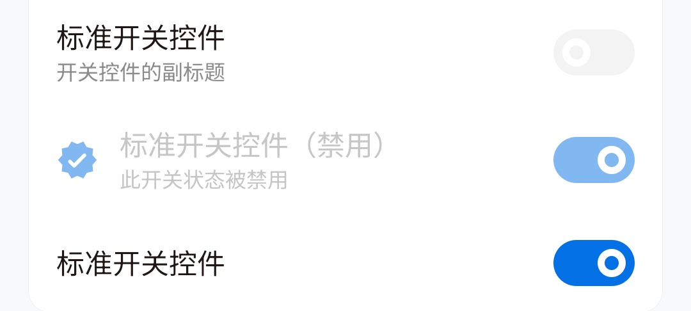
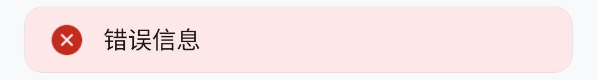

# 组件总目录

01. 标题栏：TitleBar
02. 大标题：ItemOuterLargeTitle
03. 圆角列：RoundedColumn
04. 复选框：ItemCheck
05. 按钮：ItemButton
06. 标题：ItemTitle
07. 标准项：Item
08. 开关：ItemSwitcher
09. 提示：ItemTip
10. 信息：ItemInfo
11. 值：ItemValue
12. 输入框：ItemEdit
13. 密码框：ItemEditPassword
14. 弹出菜单：ItemPopup
15. 对话框：YesNoDialog, YesDialog, InputDialog
16. 滑块：ItemSlider
17. 底部栏：BottomBar
18. 底部栏项：BottomBarItem

---

## 1. 标题栏：TitleBar


```kotlin
TitleBar(
    onBack = { /* 返回按钮回调 */ },
    text = "标题"
)
```

---

## 2. 大标题：ItemOuterLargeTitle

```kotlin
ItemOuterLargeTitle(
    text = "Hello, SaltUI 2.0",
    sub = "SaltUI（UI for Salt Player） 是提取自椒盐音乐的 UI 风格组件，用以快速生成椒盐音乐风格用户界面。本库将会广泛用以椒盐系列 App 开发，以达到快速开发目的"
)
```

---

## 3. 圆角列：RoundedColumn

```kotlin
RoundedColumn {
    // 内部放置其他组件
}
```

---

## 4. 复选框：ItemCheck


```kotlin
ItemCheck(
    state = true, //开关启用状态
    onChange = {

    },
    text = "选中按钮"
)
```

---

## 5. 按钮：ItemButton

```kotlin
ItemButton(
    onClick = {

    },
    text = "默认按钮 TextButton 默认按钮 TextButton 默认按钮 TextButton",
    primary = false//强调色开关
)
```

---

## 6. 小标题：ItemTitle

```kotlin
ItemTitle(text = "标题")
```

---

## 7. 标准项：Item

```kotlin
Item(
   onClick = {},
   iconPainter = painterResource(R.drawable.ic_qr_code),
   iconColor = SaltTheme.colors.highlight,
   text = "标准 Item 控件，带图标（可选），副标题文本（可选）",
   sub = "Item 控件的副标题"
)
```

---

## 8. 开关：ItemSwitcher

```kotlin
var switch by remember { mutableStateOf(false) }
ItemSwitcher(
        state = switch,
        onChange = {
            switch = it
        },
        iconPainter = painterResource(Res.drawable.ic_verified),
        iconColor = SaltTheme.colors.highlight,
        text = "标准开关控件，带图标（可选），副标题文本（可选）",
        sub = "开关控件的副标题"
    )
}
```

---

## 9. 提示：ItemTip

```kotlin
ItemTip(text = "提示信息")
```

---

## 10. 信息：ItemInfo

```kotlin
ItemInfo(
    text = "警告信息",
    infoType = ItemInfoType.Warning
)
```

---


```kotlin
ItemValue(text = "Value 标题", sub = "Value 内容")
```

---

## 12. 输入框：ItemEdit

```kotlin
var text by remember { mutableStateOf("") }
ItemEdit(
    text = text,
    onChange = {
        text = it
    },
    hint = "HINT 这是输入框"
)
```

---

## 13. 密码框：ItemEditPassword

```kotlin
var text2 by remember { mutableStateOf("") }
ItemEditPassword(
    text = text2,
    onChange = {
        text2 = it
    },
    hint = "HINT 这是密码输入框"
)
```

---

## 14. 弹出菜单：ItemPopup

```kotlin
val popupState = rememberPopupState()
ItemPopup(
    state = popupState,
    text = "Popup Item",
    sub = "Value"
) {//多个自行添加即可
PopupMenuItem(
        onClick = {
            popupState.dismiss()
        },
        selected = true,
        text = "选项一",
        sub = "这是选项一的介绍信息"
    )
}
```

---

## 15. 对话框：YesNoDialog, YesDialog, InputDialog

```kotlin
var yesNoDialog by remember { mutableStateOf(false) }
if (yesNoDialog) {
    YesNoDialog(
        onDismissRequest = { yesNoDialog = false },
        onConfirm = { yesNoDialog = false },
        title = "YesNoDialog",
        content = "这是一个是否确认的对话框"
    )
}
Item(
    onClick = {
        yesNoDialog = true
    },
    text = "YesNoDialog",
    arrowType = ItemArrowType.Link
)
___
var yesDialog by remember { mutableStateOf(false) }
if (yesDialog) {
    YesDialog(
        onDismissRequest = { yesDialog = false },
        title = "YesDialog",
        content = "这是一个是否确认的对话框"
    )
}
Item(
    onClick = {
        yesDialog = true
    },
    text = "YesDialog"
)
___
var inputDialog by remember { mutableStateOf(false) }
if (inputDialog) {
    var inputText by remember { mutableStateOf("") }
    InputDialog(
        onDismissRequest = {
            inputDialog = false
        },
        onConfirm = {
            inputDialog = false
        },
        title = "文本输入",
        text = inputText,
        onChange = {
            inputText = it
        }
    )
}
```

---

## 16. 滑块：ItemSlider

```kotlin
var slider by remember { mutableStateOf(0f) }
ItemSlider(
    value = slider,
    onValueChange = {
        slider = it
    },
    iconPainter = painterResource(Res.drawable.ic_qr_code),
    iconColor = SaltTheme.colors.text,
    text = "Slider 滑块",
    // sub = "滑块介绍"
    steps = 2
)
```

---

## 17. 底部栏：BottomBar

```kotlin
BottomBar {
    BottomBarItem(
    state = true,
    onClick = {},
    painter = painterResource(Res.drawable.ic_qr_code),
    text = "二维码"
    )
    BottomBarItem(
    state = false,
    onClick = {},
    painter = painterResource(Res.drawable.ic_verified),
    text = "认证"
    )
}
```

---

## 18. 底部栏项：BottomBarItem

```kotlin
BottomBarItem(
    state = true,
    onClick = { /* 点击回调 */ },
    painter = painterResource(Res.drawable.ic_qr_code),
    text = "底部栏项"
)
```

---