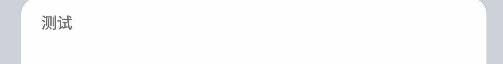

# 组件总目录

01. 标题栏：TitleBar
02. 大标题：ItemOuterLargeTitle
03. 圆角列：RoundedColumn
04. 复选框：ItemCheck
05. 按钮：ItemButton
06. 文字按钮：TextButton
07. 标题：ItemTitle
08. 标准项：Item
09. 开关：ItemSwitcher
10. 提示：ItemTip
11. 信息：ItemInfo
12. 值：ItemValue
13. 输入框：ItemEdit
14. 密码框：ItemEditPassword
15. 弹出菜单：ItemPopup
16. 对话框：YesNoDialog, YesDialog, InputDialog
17. 滑块：ItemSlider
18. 底部栏：BottomBar

---

## 1. 标题栏：TitleBar


```kotlin
TitleBar(
    onBack = { /* 返回按钮回调 */ },
    text = "标题"
    false//是否显示返回
)
```

---

## 2. 大标题：ItemOuterLargeTitle


```kotlin
ItemOuterLargeTitle(
    text = "Hello, SaltUI 2.0",
    sub = "SaltUI（UI for Salt Player） 是提取自椒盐音乐的 UI 风格组件，用以快速生成椒盐音乐风格用户界面。本库将会广泛用以椒盐系列 App 开发，以达到快速开发目的"
)
```

---

## 3. 圆角列：RoundedColumn


```kotlin
RoundedColumn {
    // 内部放置其他组件
}
```

---

## 4. 复选框：ItemCheck


```kotlin
ItemCheck(
    state = true, //开关启用状态
    onChange = {

    },
    text = "选中按钮"
)
```

---

## 5. 按钮：ItemButton


```kotlin
ItemButton(
    onClick = {

    },
    text = "默认按钮 TextButton 默认按钮 TextButton 默认按钮 TextButton",
    primary = false//强调色开关
)
```

## 6. 文字按钮：TextButton


```kotlin
TextButton(
    onClick = {
        }
    },
    text = "确定",
)
```

---

## 7. 小标题：ItemTitle


```kotlin
ItemTitle(text = "标题")
```

---

## 8. 标准项：Item


```kotlin
Item(
   onClick = {},
   iconPainter = painterResource(R.drawable.ic_qr_code),
   iconColor = SaltTheme.colors.highlight,
   text = "标准 Item 控件，带图标（可选），副标题文本（可选）",
   sub = "Item 控件的副标题"
)
```

---

## 9. 开关：ItemSwitcher

```kotlin
var switch by remember { mutableStateOf(false) }
ItemSwitcher(
        state = switch,
        onChange = {
            switch = it
        },
        iconPainter = painterResource(Res.drawable.ic_verified),
        iconColor = SaltTheme.colors.highlight,
        text = "标准开关控件，带图标（可选），副标题文本（可选）",
        sub = "开关控件的副标题"
    )
}
```

---

## 10. 提示：ItemTip

```kotlin
ItemTip(text = "提示信息")
```

---

## 11. 信息：ItemInfo

```kotlin
ItemInfo(
    text = "警告信息",
    infoType = ItemInfoType.Warning
)
```

---

## 12. 值：ItemValue

```kotlin
ItemValue(text = "Value 标题", sub = "Value 内容")
```

---

## 13. 输入框：ItemEdit

```kotlin
var text by remember { mutableStateOf("") }
ItemEdit(
    text = text,
    onChange = {
        text = it
    },
    hint = "HINT 这是输入框"
)
```

---

## 14. 密码框：ItemEditPassword

```kotlin
var text2 by remember { mutableStateOf("") }
ItemEditPassword(
    text = text2,
    onChange = {
        text2 = it
    },
    hint = "HINT 这是密码输入框"
)
```

---

## 15. 弹出菜单：ItemPopup


```kotlin
val popupState = rememberPopupState()
ItemPopup(
    state = popupState,
    text = "Popup Item",
    sub = "Value"
) {
PopupMenuItem(
        onClick = {
            popupState.dismiss()
        },
        selected = true,
        text = "选项一",
        sub = "这是选项一的介绍信息"
    )//多个重复添加即可
}
```

---

## 16. 对话框：YesNoDialog, YesDialog, InputDialog


```kotlin
//YesNoDialog
var yesNoDialog by remember { mutableStateOf(false) }
if (yesNoDialog) {
    YesNoDialog(
        onDismissRequest = { yesNoDialog = false },
        onConfirm = { yesNoDialog = false },
        title = "YesNoDialog",
        content = "这是一个是否确认的对话框"
    )
}
Item(
    onClick = {
        yesNoDialog = true
    },
    text = "YesNoDialog",
    arrowType = ItemArrowType.Link
)

//YesDialog
var yesDialog by remember { mutableStateOf(false) }
if (yesDialog) {
    YesDialog(
        onDismissRequest = { yesDialog = false },
        title = "YesDialog",
        content = "这是一个是否确认的对话框"
    )
}
Item(
    onClick = {
        yesDialog = true
    },
    text = "YesDialog"
)

//InputDialog
var inputDialog by remember { mutableStateOf(false) }
if (inputDialog) {
    var inputText by remember { mutableStateOf("") }
    InputDialog(
        onDismissRequest = {
            inputDialog = false
        },
        onConfirm = {
            inputDialog = false
        },
        title = "文本输入",
        text = inputText,
        onChange = {
            inputText = it
        }
    )
}
```

---

## 17. 滑块：ItemSlider

```kotlin
var slider by remember { mutableStateOf(0f) }
ItemSlider(
    value = slider,
    onValueChange = {
        slider = it
    },
    iconPainter = painterResource(Res.drawable.ic_qr_code),
    iconColor = SaltTheme.colors.text,
    text = "Slider 滑块",
    // sub = "滑块介绍"
    steps = 2
)
```

---

## 18. 底部栏：BottomBar


```kotlin
BottomBar {
    BottomBarItem(
    state = true,
    onClick = {},
    painter = painterResource(Res.drawable.ic_qr_code),
    text = "二维码"
    )
    BottomBarItem(
    state = false,
    onClick = {},
    painter = painterResource(Res.drawable.ic_verified),
    text = "认证"
    )//多个自行添加
}
```

---